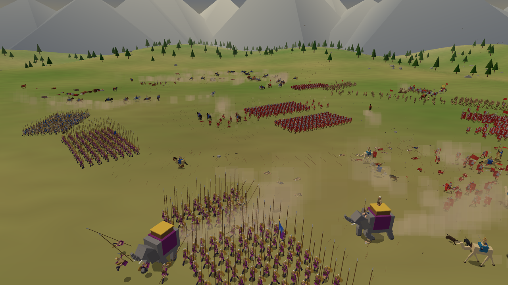
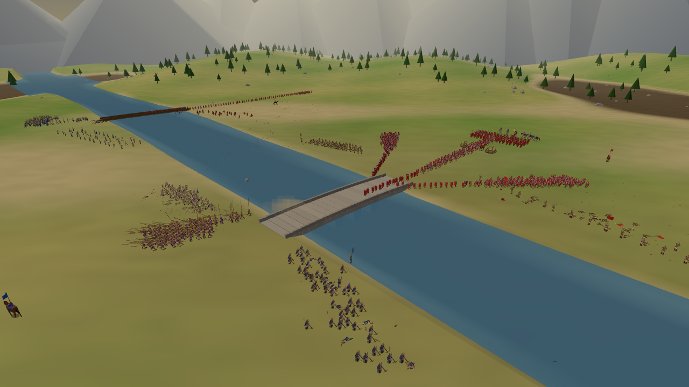
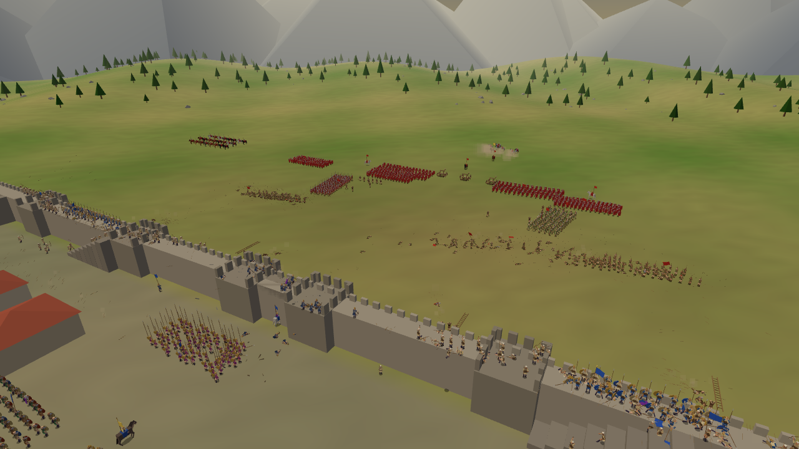

# Legiomachia

An ancient battle simulator in the browser (WebGL / three.js, plain JavaScript).

**Live demo: https://reki2000.github.io/legiomachia/**

Infantry, cavalry, war elephants, chariots, camels, war dogs and siege engines march, charge and crash into each other — with PS1-era low-poly visuals and an emphasis on believable human motion.



| River crossing | Siege |
|---|---|
|  |  |

```
npm install
npm run dev        # http://localhost:5173/
npm run build      # static build in dist/
```

URL parameters: `?stage=field|hills|forest|canyon|river|ford|bridge|harbor|siege|camp`, `?weather=clear|fog|rain|dusk|night`, `?mode=annihilate|capture|reinforce|retreat`, `?cam=cine|free|follow`, `?size=S|M|L|XL|XXL`, `?seed=<number>`, `?autostart=<seconds>`

## Stages

| Stage | Description |
|---|---|
| Open field | A pitched battle. Engineers drive anti-cavalry stakes before the fighting starts. |
| Hills | Two round hills flank the field. The high ground hits harder and uphill is slow going; each side's missile troops start on a hill. |
| Forest | Woods across the middle, every tree a solid block: men walk around them and arrows stop in them. Only a few lanes and glades are open, so the armies funnel through. |
| Canyon | Sheer cliffs close to a narrow neck. Formations form up narrower and deeper. |
| River crossing | A stone bridge, a wooden bridge and a ford. Regiments funnel into columns to cross. Defending engineers can destroy the wooden bridge, attacking engineers build a pontoon bridge. Men pushed into the river swim or drown. |
| Ford | Shallows all along the river, with a few deep pools. No bridges. |
| Broken bridge | Deep water and a single wooden bridge that the defenders tear down as the attackers approach; two pontoon sites. |
| Harbour | A wide channel with no crossing at all and moored boats on the far bank: three engineer companies throw pontoon bridges under fire. |
| Siege | A walled city with towers, a gate and houses. A battering ram breaks the gate, engineers carry and raise ladders, onagers hurl rocks at the walls. Defenders push ladders down; reserves inside the city fight at the breach. |
| Camp raid | A palisaded army camp: lower, smaller, tents instead of houses; the same ladders, ram and gate. |

**Weather** (`?weather=`): fog and night shorten sight, rain slows the march and spoils aim, dusk is just for looks.

**Victory conditions** (`?mode=`): *annihilate* (default); *capture* a flag (the defenders win by holding out); *reinforce* (fresh regiments arrive mid-battle, including a relief force behind the besiegers); *retreat* (open ground only: get half the Legion off the field before time runs out while the Kingdom's army is on its heels).

The world is a height field plus a raster of man-made floors: walls are plateaus, ladders are steep ramps and bridges are causeways over water.
Pathfinding uses A* on a 2 m grid with connected-component checks, so impossible routes fail instantly. Regiments snake along their path and automatically narrow into columns in tight passages.

## Units and weapons

- **Infantry**: sword, axe (breaks shields), mace (knocks men down), spear, pike/sarissa (deadly to cavalry, weak once an enemy is inside its reach), javelins (three throws, then melee), sling (whirled overhead), bow (volleys and aimed shots), crossbow (powerful, slow to reload), engineers (stakes, ladders, pontoons, bridge demolition)
- **Mounted and animals**: cavalry (charge, withdraw, charge again), cataphracts (barded horses), horse archers (circle at range, turn in the saddle to shoot), camel riders (horses fear them), war elephants (can panic and trample their own side), scythed chariots, war dogs (bite and drag men down)
- **Siege engines**: covered battering ram pushed by its crew, onager whose rocks throw bodies around the impact point

## Individual soldiers

Every soldier is generated with their own build, strength, speed, vitality, defensive skill and courage, plus a name. The unit's quality (levy to veteran) shifts the averages.

- Changing during battle: HP, stamina (drained by running and fighting, recovered by resting) and morale.
- Morale drops when nearby comrades die, when attacked from behind, near elephants, with casualties and fatigue. It is supported by nearby leaders.
- A soldier out of morale flees on their own and may rally once safe. When more than half a regiment flees it routs, and panic spreads to neighbouring units.
- Exhausted men in the front rank swap places with fresh men from the rear.

## Chain of command

General → wing commanders (left, centre, right, reserve, …) → regiment captains and standard bearers.

- Commanders ride behind their troops and support the morale of nearby regiments.
- When a general or commander falls, morale collapses across their command and the AI reacts more slowly.
- A fallen captain or standard shakes the regiment. Another soldier picks up a fallen standard and raises it again.
- Player orders to a regiment whose superiors are dead arrive late by messenger (shown as "伝令中" in the UI).
- The AI is hierarchical too: the general decides when to commit reserves, wing commanders share out targets among their regiments, and cavalry swings around the flank before charging.

In the army tree on the left, clicking a commander selects every regiment under them. Clicking a soldier shows their name and stats.

## Controls

| Input | Action |
|---|---|
| WASD / arrows, Q/E, R/F, wheel | Pan, rotate, tilt, zoom |
| Middle drag / Alt + left drag | Orbit |
| Left click / drag | Select regiments (Shift to add); clicking a soldier shows their stats |
| Right click | Move; on an enemy: attack (archers shoot); right drag sets facing |
| Right click with engineers selected | River → pontoon, bridge → demolish, wall → ladder, ground → stakes |
| H / V / C / X / B | Hold / advance / charge / fire / fall back |
| Panel buttons | Formation (tight / normal / loose; tight resists arrows), engineer tasks, hand back to AI |
| Enter / Space / Z | Start battle / pause / slow motion |
| 1 / 2 / 3, T | Camera: free / follow / cinematic; follow the soldier under the cursor |
| P | PS1-style rendering (low resolution + vertex snapping) |
| M | Toggle the background music |

The UI text is in Japanese.

## Scale and performance

- Battle sizes range from S (~800) to XXL (~20,000).
- Battles with more than 6,000 bodies step the simulation at 30 Hz.
- Rendering uses three levels of detail: distant soldiers re-pose less often, and settled corpses are moved into a static buffer.
- Simulation cost per step in Node: about 2–4 ms for M (~2,000 soldiers), about 15 ms for XL (~9,500) and about 30 ms for XXL (~18,000). XXL is experimental and heavy once rendering is included.

## How the motion works

- **Procedural animation** (`src/anim/human.js`): an 18-joint skeleton posed every frame.
  - Stride and gait phase follow the actual speed, so feet do not slide.
  - Arms and legs are solved with two-bone IK.
  - Attacks, blocks, draws, throws, climbing, carrying and swimming are blended from keyframed curves.
- **Ragdolls** (`src/sim/ragdoll.js`): the same joints switch to position-based physics when a soldier dies or is knocked down. Survivors blend back into a get-up animation.
- **Quadrupeds** (`src/anim/quadruped.js`): one parametric rig for horses, camels and dogs, with walk-to-gallop phase blending and rearing, plus a separate elephant rig.
- **Impacts** (`src/sim/world.js`): mounts use capsule collision. Impact strength depends on mass ratio and closing speed, and heavy bodies lose momentum as they plough through. Braced spear and pike men can impale charging horses.

## Code layout

```
src/
  main.js             boot, UI (army tree, soldier card, orders), main loop
  camera.js           RTS camera, follow camera, cinematic director (including pulled-back wide shots)
  terrain.js          height API (backed by the stage), terrain / water / scenery meshes
  scenario.js         army deployments and chain of command per stage
  sound.js            procedural WebAudio sound effects (no assets)
  weather.js          sky, fog, light, rain and stars for each weather, and its effect on the battle
  music.js            procedural background music (bass, war drums, a short melody)
  anim/human.js       procedural human animation
  anim/quadruped.js   horse / camel / dog rig and the elephant
  sim/stage.js        stages: terrain, structure raster, bridges, ladders, gate, stakes, forest
  sim/nav.js          navigation grid, A*, connected components, clearance
  sim/agent.js        soldiers (stats, morale, stamina) and regiments (path-following formations)
  sim/world.js        update loop, collisions and impacts, combat, falls and water, missiles, order API
  sim/ai.js           regiment and individual behaviour
  sim/objective.js    victory conditions: capture, reinforcements, retreat
  sim/command.js      chain of command, morale auras, hierarchical AI, stage plans
  sim/engineering.js  engineer tasks and siege engines
  sim/projectiles.js  arrows, javelins, sling stones, bolts, onager rocks
  sim/ragdoll.js      PBD ragdoll aware of structures and water
  render/*            instanced rendering of bodies, structures and particles
tools/                headless checks: bench.mjs / density.mjs (Node simulation), battle.mjs / ui.mjs (browser screenshots and UI tests)
```

## License

MIT — see [LICENSE](LICENSE).
